# Mini RISC-V CPU Specification

## Overview

This document specifies a simple single-cycle RISC-V CPU with a minimal instruction set and single interrupt support. Based on the single-cycle datapath architecture.

## Architecture

- **ISA**: RISC-V RV32I subset
- **Data Width**: 32-bit
- **Address Width**: 32-bit
- **Registers**: 32 general-purpose registers (x0-x31), x0 is hardwired to 0
- **Memory**: Harvard architecture (separate Instruction and Data memory)
- **Endianness**: Little-endian
- **Clock**: Single system clock
- **Reset**: Active-low synchronous reset

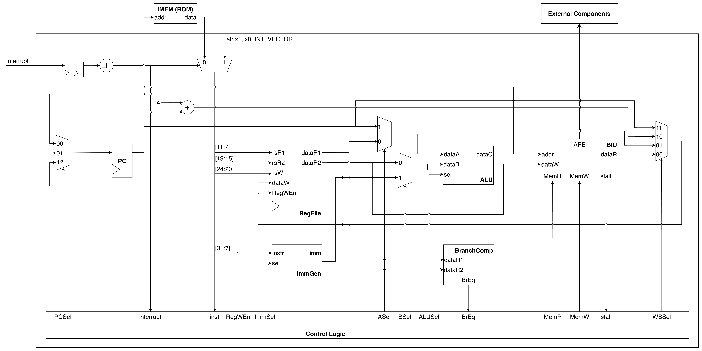

---

## Hardware Components

### IMEM (Instruction Memory - ROM) (external)
| Port | Width | Direction | Description |
|------|-------|-----------|-------------|
| addr | 32-bit | Input | Instruction address |
| instr | 32-bit | Output | Instruction data (combinational read) |

### BIU (Bus Interface Unit)

The BIU implements the APB3 master interface for data memory and peripheral access.

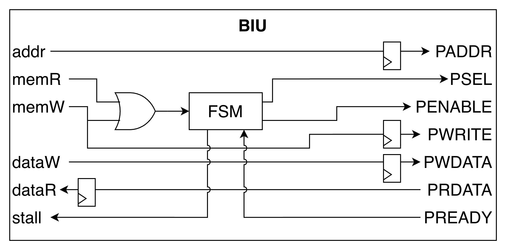

**Note:** Flip-flops are added to output signals (PADDR, PWDATA, PWRITE) and input data (PRDATA) to relax timing.

#### Inputs/Outputs

| Port | Width | Direction | Description |
|------|-------|-----------|-------------|
| addr | 32-bit | Input | Data address from CPU |
| dataW | 32-bit | Input | Data to write from CPU |
| dataR | 32-bit | Output | Data read to CPU |
| MemR | 1-bit | Input | Read enable (active high) |
| MemW | 1-bit | Input | Write enable (active high) |

**APB3 Interface (BIU → External Bus)**

| Port | Width | Direction | Description |
|------|-------|-----------|-------------|
| PADDR | 32-bit | Output | Address to APB3 bus |
| PWDATA | 32-bit | Output | Write data to APB3 bus |
| PRDATA | 32-bit | Input | Read data from APB3 bus |
| PWRITE | 1-bit | Output | Write=1/Read=0 control |
| PSEL | 1-bit | Output | Slave select |
| PENABLE | 1-bit | Output | Transfer strobe |
| PREADY | 1-bit | Input | Slave ready (0=wait, 1=complete) |

**Stall Signal (BIU → CPU)**

| Port | Width | Direction | Description |
|------|-------|-----------|-------------|
| BIU_stall | 1-bit | Output | Stall request (1=busy, 0=ready) |

#### BIU State Machine

| State | PSEL | PENABLE | Next State |
|-------|------|---------|------------|
| IDLE | 0 | 0 | SETUP (if MemR/MemW) |
| SETUP | 1 | 0 | ACCESS |
| ACCESS | 1 | 1 | ACCESS (if !PREADY) / DONE (if PREADY) |
| DONE | 0 | 0 | IDLE |

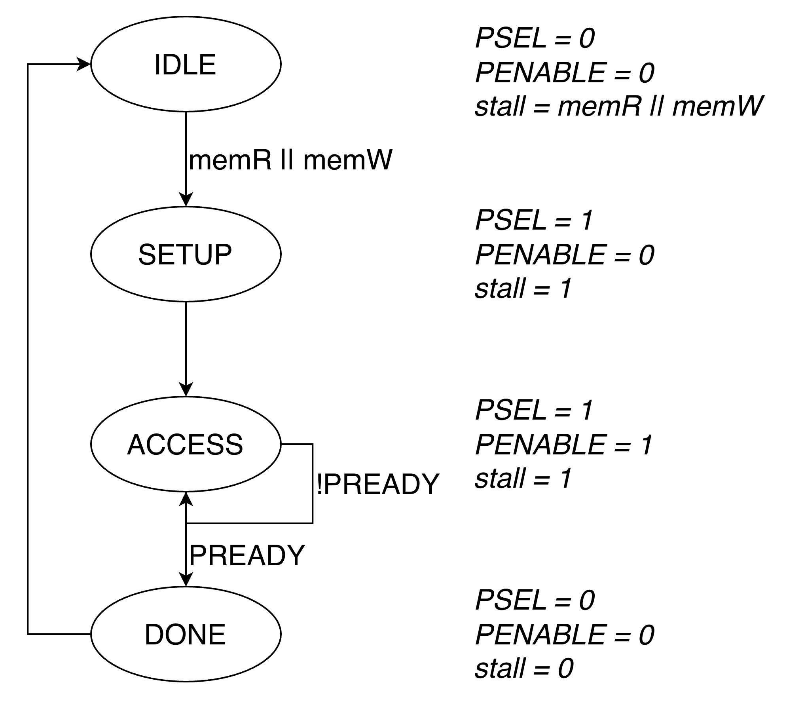

**State transitions:**

- **IDLE → SETUP**: When `memR || memW` (memory access requested)
- **SETUP → ACCESS**: Unconditional (1 cycle)
- **ACCESS → DONE**: When `PREADY` (transfer complete)
- **ACCESS → ACCESS**: When `!PREADY` (wait states inserted)
- **DONE → IDLE**: Unconditional (1 cycle)

**Transaction cycles:**

- **MemR cycle**: IDLE → SETUP → ACCESS → [ACCESS...] → DONE → IDLE (capture PRDATA when PREADY=1)
- **MemW cycle**: IDLE → SETUP → ACCESS → [ACCESS...] → DONE → IDLE (write complete when PREADY=1)

#### BIU Waveforms

**BIU Read Cycle (Read)**

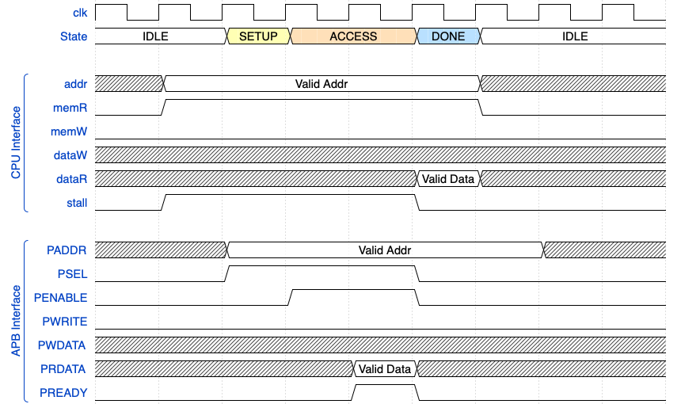

**BIU Write Cycle (Write)**

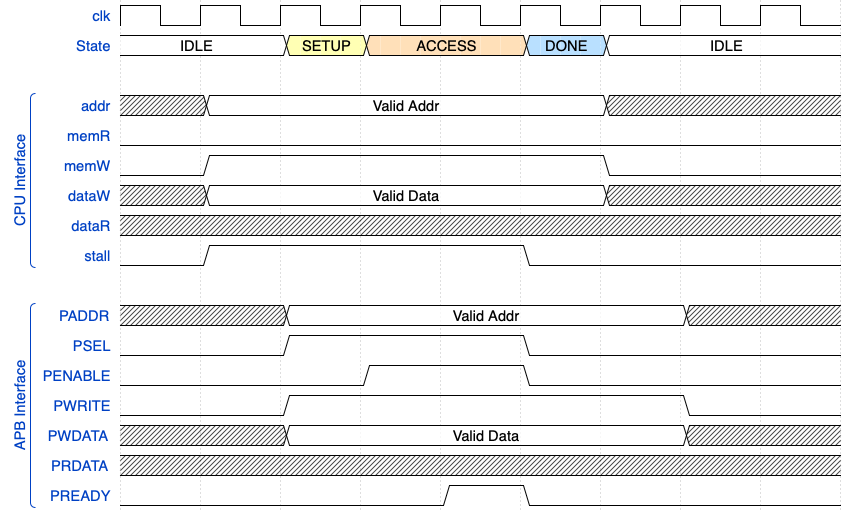

#### Stall Logic

The BIU asserts `BIU_stall=1` during memory accesses to hold the CPU pipeline.

**When BIU_stall=1, CPU control signals are overridden:**

| Signal | Value | Effect |
|--------|-------|--------|
| PCSel[1] | 1 | Hold PC (don't update) |
| RegWEn | 0 | Disable register write |
| All other signals | Unchanged | Hold constant |

### Registers

#### PC (Program Counter)
- 32-bit register holding current instruction address
- Updates on each clock cycle (gated by `BIU_stall`)

#### RegFile (Register File)

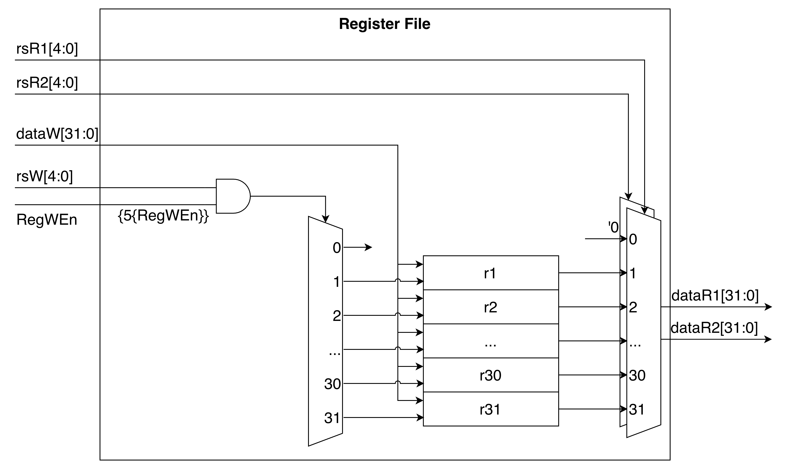

- 32 x 32-bit registers
- Two read ports (rsR1, rsR2)
- One write port (rsW, dataW, RegWEn)
- x0 always reads as 0

### ALU (Arithmetic Logic Unit)

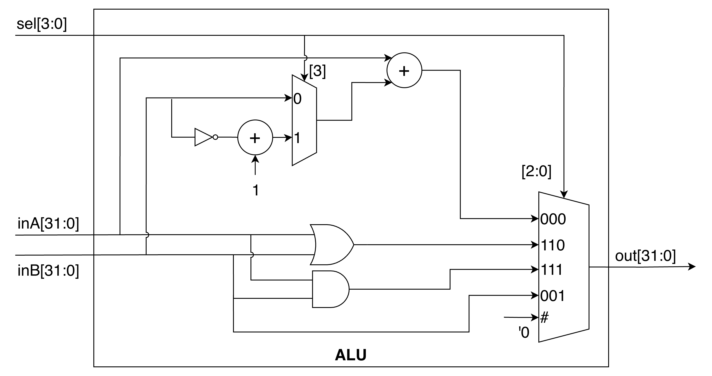

| Input | Width | Description |
|-------|-------|-------------|
| dataA | 32-bit | First operand |
| dataB | 32-bit | Second operand |
| ALUSel | 4-bit | Operation select |

| Output | Width | Description |
|--------|-------|-------------|
| dataC | 32-bit | Result |

| ALUSel | R-type | I-type |
|--------|--------|--------|
| 0000 | ADD: rd = rs1 + rs2 | ADDI: rd = rs1 + imm |
| 1000 | SUB: rd = rs1 - rs2 | N/A |
| 0110 | OR: rd = rs1 \| rs2 | ORI: rd = rs1 \| imm |
| 0111 | AND: rd = rs1 & rs2 | ANDI: rd = rs1 & imm |
| 1001 | B: rd = rs2 | N/A |
| other | **reserved** | **reserved** |

### ImmGen (Immediate Generator)

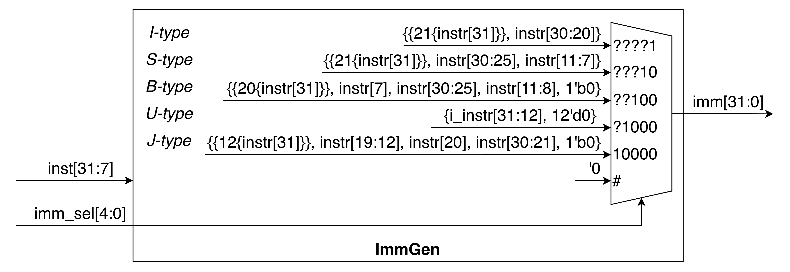

| Input | Width | Description |
|-------|-------|-------------|
| instr | 32-bit | Instruction bits [31:7] |
| ImmSel | 5-bit | Immediate type select |

| Output | Width | Description |
|--------|-------|-------------|
| imm | 32-bit | Sign-extended immediate |

| ImmSel | Type | Instructions |
|--------|------|--------------|
| 00001 | I | addi, andi, ori, jalr, lw |
| 00010 | S | sw |
| 00100 | B | beq |
| 01000 | U | lui |
| 10000 | J | jal |

### BranchComp (Branch Comparator)

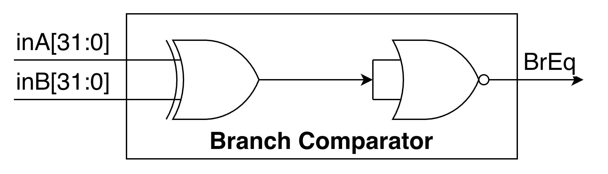

| Input | Width | Description |
|-------|-------|-------------|
| dataR1 | 32-bit | First register value |
| dataR2 | 32-bit | Second register value |

| Output | Width | Description |
|--------|-------|-------------|
| BrEq | 1-bit | 1 if dataR1 == dataR2 |

### Interrupt Logic

- **interrupt**: External interrupt signal (active high)
- Interrupt is synchronized via a rising edge detector
- On interrupt (rising edge detected):
  - `x1 ← PC` (save current PC as return address)
  - `PC ← INT_VECTOR` (jump to interrupt vector, default 0x100)
- On reset:
  - `PC ← RESET_VECTOR` (default 0x1000)
- Interrupt and reset have highest priority over normal PC update

**Hardware implementation:**

- Reuses existing datapath (ASel=0, BSel=1, imm=INT_VECTOR, ALU ADD)
- RegWEn=1, rsW=x1, WBSel=11 (PC value to x1)
- PCSel=01 loads ALU result (INT_VECTOR)

---

## Control Signals

| Signal | Width | Description |
|--------|-------|-------------|
| PCSel | 2-bit | PC source (00=PC+4, 01=jump/branch/interrupt, 1x=hold PC) |
| RegWEn | 1-bit | Register write enable |
| ImmSel | 5-bit | Immediate type selector |
| ASel | 1-bit | ALU input A source (0=rs1, 1=PC) |
| BSel | 1-bit | ALU input B source (0=dataR2, 1=imm) |
| ALUSel | 4-bit | ALU operation select |
| MemR | 1-bit | Memory read enable (active high) |
| MemW | 1-bit | Memory write enable (active high) |
| WBSel | 2-bit | Writeback source select |

### WBSel Encoding

| WBSel | Source |
|-------|--------|
| 00 | BIU dataR (load) |
| 01 | ALU result |
| 10 | PC + 4 (jal/jalr) |
| 11 | PC |

---

## Supported Instructions

**Instruction Set**: RV32I subset (13 instructions)

| Mnemonic | Format | Description |
|----------|--------|-------------|
| `add rd, rs1, rs2` | R | rd = rs1 + rs2 |
| `sub rd, rs1, rs2` | R | rd = rs1 - rs2 |
| `and rd, rs1, rs2` | R | rd = rs1 & rs2 |
| `or rd, rs1, rs2` | R | rd = rs1 \| rs2 |
| `addi rd, rs1, imm` | I | rd = rs1 + imm |
| `andi rd, rs1, imm` | I | rd = rs1 & imm |
| `ori rd, rs1, imm` | I | rd = rs1 \| imm |
| `lw rd, rs1, imm` | I | rd = Memory[rs1 + imm] |
| `sw rs2, rs1, imm` | S | Memory[rs1 + imm] = rs2 |
| `jal rd, imm` | J | rd = PC+4; PC = PC + imm |
| `jalr rd, rs1, imm` | I | rd = PC+4; PC = (rs1 + imm) & ~3 |
| `beq rs1, rs2, imm` | B | if (rs1 == rs2) PC = PC + imm |
| `lui rd, imm` | U | rd = imm << 12 |

**Notes:**

- Illegal instructions: Undefined behavior (no trap handler)
- Load/store addresses must be word-aligned (`addr[1:0] = 00`)
- Unaligned memory accesses: Undefined behavior

## Instruction Encodings

### R-Format (add, sub, and, or)
```
31        25 24    20 19    15 14    12 11         7 6       0
+------------+---------+---------+---------+-----------+-------+
|  funct7    |  rs2    |  rs1    | funct3  |    rd     | opcode|
+------------+---------+---------+---------+-----------+-------+
```

| Instruction | inst[30] | inst[14:12] | inst[6:2] | opcode |
|-------------|----------|-------------|-----------|--------|
| add | 0 | 000 | 01100 | 0110011 |
| sub | 1 | 000 | 01100 | 0110011 |
| and | 0 | 111 | 01100 | 0110011 |
| or | 0 | 110 | 01100 | 0110011 |


### I-Format (addi, andi, ori, jalr, lw)
```
31        20 19    15 14    12 11         7 6       0
+------------+---------+---------+-----------+-------+
| imm[11:0]  |  rs1    | funct3  |    rd     | opcode|
+------------+---------+---------+-----------+-------+
```

| Instruction | inst[14:12] | inst[6:2] | opcode |
|-------------|-------------|-----------|--------|
| addi | 000 | 00100 | 0010011 |
| andi | 111 | 00100 | 0010011 |
| ori | 110 | 00100 | 0010011 |
| jalr | 000 | 11001 | 1100111 |
| lw | 010 | 00000 | 0000011 |

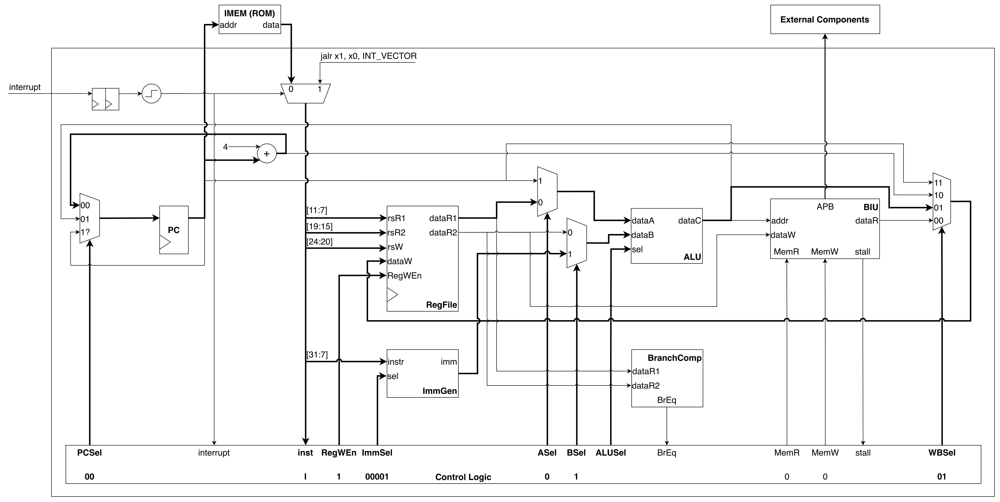


### S-Format (sw)
```
31        25 24    20 19    15 14    12 11         7 6       0
+------------+---------+---------+---------+-----------+-------+
| imm[11:5]  |  rs2    |  rs1    | funct3  | imm[4:0]  | opcode|
+------------+---------+---------+---------+-----------+-------+
```

| Instruction | inst[14:12] | inst[6:2] | opcode |
|-------------|-------------|-----------|--------|
| sw | 010 | 01000 | 0100011 |

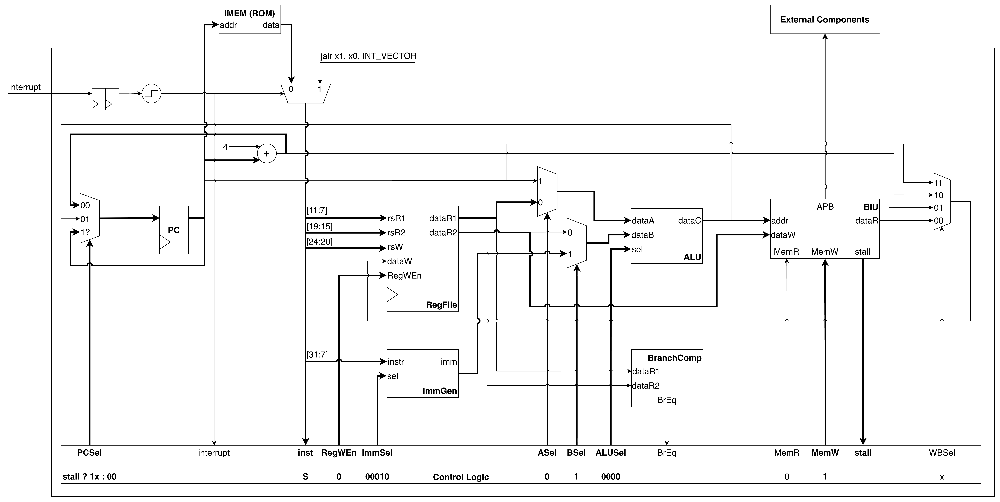

### J-Format (jal)
```
31        20 19    12 11         7 6       0
+------------+-----------+-----------+-------+
|imm[20|10:1] | imm[11] | imm[19:12]| opcode|
+------------+-----------+-----------+-------+
```

| Instruction | inst[6:2] | opcode |
|-------------|-----------|--------|
| jal | 11011 | 1101111 |

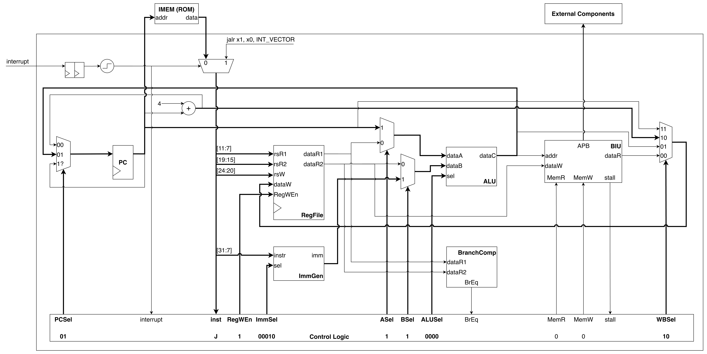

### B-Format (beq)
```
31        25 24    20 19    15 14    12 11         7 6       0
+------------+---------+---------+---------+-----------+-------+
|imm[12|10:5]|  rs2    |  rs1    | funct3  |imm[4:1|11]| opcode|
+------------+---------+---------+---------+-----------+-------+
```

| Instruction | inst[14:12] | inst[6:2] | opcode |
|-------------|-------------|-----------|--------|
| beq | 000 | 11000 | 1100011 |

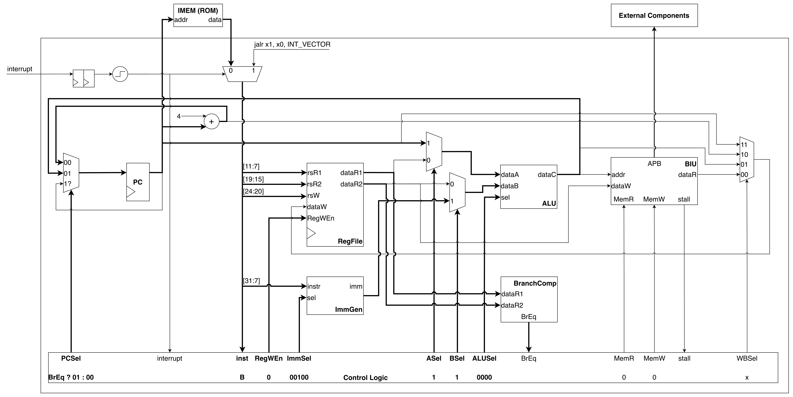

### U-Format (lui)
```
31        12 11         7 6       0
+------------+-----------+-------+
| imm[31:12] |    rd     | opcode|
+------------+-----------+-------+
```

| Instruction | inst[6:2] | opcode |
|-------------|-----------|--------|
| lui | 01101 | 0110111 |


---

## Control Signal Table

| Instruction | opcode | inst[6:2] | inst[14:12] | inst[30] | BrEq | PCSel | ImmSel | ASel | BSel | ALUSel | MemR | MemW | RegWEn | WBSel |
|-------------|--------|-----------|-------------|----------|------|-------|--------|------|------|--------|------|------|--------|-------|
| add | 0110011 | 01100 | 000 | 0 | 0 | 00 | - | 0 | 0 | 0000 | 0 | 0 | 1 | 01 |
| sub | 0110011 | 01100 | 000 | 1 | 0 | 00 | - | 0 | 0 | 1000 | 0 | 0 | 1 | 01 |
| and | 0110011 | 01100 | 111 | 0 | 0 | 00 | - | 0 | 0 | 0111 | 0 | 0 | 1 | 01 |
| or | 0110011 | 01100 | 110 | 0 | 0 | 00 | - | 0 | 0 | 0110 | 0 | 0 | 1 | 01 |
| addi | 0010011 | 00100 | 000 | 0 | 0 | 00 | 00001 | 0 | 1 | 0000 | 0 | 0 | 1 | 01 |
| andi | 0010011 | 00100 | 111 | 0 | 0 | 00 | 00001 | 0 | 1 | 0111 | 0 | 0 | 1 | 01 |
| ori | 0010011 | 00100 | 110 | 0 | 0 | 00 | 00001 | 0 | 1 | 0110 | 0 | 0 | 1 | 01 |
| lw | 0000011 | 00000 | 010 | 0 | 0 | 00 | 00001 | 0 | 1 | 0000 | 1 | 0 | 1 | 00 |
| sw | 0100011 | 01000 | 010 | 0 | 0 | 00 | 00010 | 0 | 1 | 0000 | 0 | 1 | 0 | - |
| jal | 1101111 | 11011 | - | - | - | 01 | 10000 | 1 | 1 | 0000 | 0 | 0 | 1 | 10 |
| jalr | 1100111 | 11001 | - | - | - | 01 | 00001 | 0 | 1 | 0000 | 0 | 0 | 1 | 10 |
| beq | 1100011 | 11000 | 000 | 0 | BrEq | 00/01 | 00100 | 1 | 1 | 0000 | 0 | 0 | 0 | - |
| lui | 0110111 | 01101 | - | - | - | 00 | 01000 | 0 | 1 | 1001 | 0 | 0 | 1 | 01 |
| interrupt | - | - | - | - | - | 01 | 00001 | 0 | 1 | 0000 | 0 | 0 | 1 | 11 |
| stall | - | - | - | - | - | 1x | - | - | - | - | - | - | 0 | - |

---
